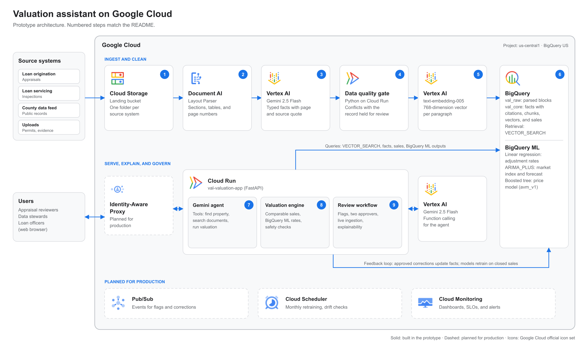

# Valuation assistant on Google Cloud

A prototype property valuation assistant that answers questions from unstructured documents (appraisals, inspections, and permits) with page-level citations, and computes values with statistical models instead of the language model.

All data is synthetic. The prototype is set in a fictional town, Cedar Hollow.

## The problem

Valuation evidence often lives in PDFs spread across systems that don't share data. For one property in the sample data, the county record lists 1,240 sq ft of living area, while page 2 of an inspection report documents an 840 sq ft addition. Standard retrieval-augmented generation (RAG) can retrieve that text, but it loses layout and page references, doesn't check documents against the system of record, and leaves arithmetic to the model.

## Architecture



The diagram uses the official [Google Cloud icons](https://cloud.google.com/icons). Its source is [`docs/architecture/build_architecture.py`](docs/architecture/build_architecture.py); an SVG version is in the same folder.

## How it works

Step numbers match the diagram.

### Ingest and clean

1. **Land.** Source documents arrive in a **Cloud Storage** landing bucket, in one folder per source system (loan origination, loan servicing, county feed, uploads). A manifest maps each document to a property.
1. **Parse.** The **Document AI Layout Parser** processor splits each PDF into sections, paragraphs, and tables, and keeps the page number of every block (`pipeline/ingest.py`, `pipeline/run_pipeline.py`).
1. **Extract.** **Gemini 2.5 Flash on Vertex AI** returns typed facts as JSON (living area, condition, unrecorded additions, permit numbers), each with its page and a source quote.
1. **Check.** The **data quality gate**, Python code running on **Cloud Run**, compares each fact with the system of record. A conflicting value-moving fact is held, a review item is opened, and the valuation engine withholds the value until two reviewers resolve it.
1. **Embed.** **`text-embedding-005` on Vertex AI** creates a 768-dimension vector for each paragraph.
1. **Store and retrieve.** **BigQuery** load jobs write parsed blocks (`val_raw`), facts with citations, and chunks with vectors (`val_core`). Retrieval uses BigQuery **`VECTOR_SEARCH`**, filtered to one property (`agent/retrieval.py`). **BigQuery ML** trains the models the engine uses: linear regression adjustment rates for each neighborhood, an **ARIMA_PLUS** market index with forecast, and a boosted tree price model (`avm_v1`).

### Serve, explain, and govern

7. **Answer.** A **Gemini 2.5 Flash** agent on **Vertex AI**, called from the **Cloud Run** app, uses function calling with three tools: find the property, search its documents, and run the valuation (`agent/appraisal_agent.py`). Every number in an answer comes from a tool output. When a value is withheld, the tool doesn't return the range, so the model can't state it.
1. **Value.** The **valuation engine** (Python on Cloud Run) selects comparable sales, adjusts them for market change with the market index and for feature differences with the BigQuery ML regression rates, weights them, blends the result with a price model, and runs safety checks. If a check fails, it withholds the value and routes the property to an appraiser (`valuation/engine.py`, `valuation/gates.py`).
1. **Govern.** The **review workflow** in the Cloud Run app handles flags and corrections. A value-moving change requires evidence and two independent approvers; the server rejects approvals from the person who flagged the fact and from anyone with a stake in the loan. Reviewers can also trigger live ingestion of a newly landed document.

Each answer also shows the issues found by code, a six-step walkthrough of the valuation, the documents reviewed, and the agent's tool calls with their raw inputs and outputs (`app/explain.py`).

| Google Cloud service | Use |
|---|---|
| Cloud Storage | Landing bucket for source documents |
| Document AI | Layout Parser processor |
| Vertex AI | `gemini-2.5-flash` (extraction and agent), `text-embedding-005` (embeddings) |
| BigQuery | Datasets `val_raw`, `val_core`, `val_ml`, `val_ops`; `VECTOR_SEARCH` |
| BigQuery ML | ARIMA_PLUS market index, linear regression adjustment rates, boosted tree price model |
| Cloud Run | Web app, agent orchestration, valuation engine, and review workflow |

## Repository layout

| Path | Contents |
|---|---|
| `agent/` | Gemini agent, tools, and BigQuery vector retrieval |
| `app/` | FastAPI app, templates, static assets, and explainability |
| `valuation/` | Deterministic valuation engine and risk gates |
| `pipeline/` | Batch document pipeline and single-document ingestion |
| `sql/` | Reference BigQuery SQL |
| `scripts/` | Provisioning, seeding, model training, and deployment |
| `data_gen/` | Synthetic data and PDF generators |
| `jobs/` | Drift monitoring job |
| `infra/terraform/` | Terraform module (reference) |
| `clearline/` | UI design system |
| `docs/` | Architecture and design specifications |
| `docs/customer/` | Scope, design decisions, model selection, cost estimate, and FAQ |
| `tests/` | Unit and integration tests |

## Get started

### Prerequisites

- A Google Cloud project with billing enabled
- The Google Cloud CLI, authenticated with `gcloud auth application-default login`
- Python 3.12 and [uv](https://docs.astral.sh/uv/)

### Set up and run

1. In `config/settings.yaml`, set your project ID, region, and Document AI processor (see `config/settings.example.yaml` for every option).
1. Install dependencies:

   ```
   make setup
   ```

1. Enable APIs and create buckets, datasets, and topics:

   ```
   make infra
   ```

1. Generate synthetic data and load it:

   ```
   make data
   ```

1. Parse the demo documents and train the BigQuery ML models:

   ```
   make pipeline
   make models
   ```

1. Run the app locally at `http://localhost:8000`:

   ```
   make app
   ```

1. Optional: deploy to Cloud Run:

   ```
   make deploy
   ```

Run the tests with `make test`.

## Try it

| Property | What it shows |
|---|---|
| 14 Larkspur Ln | Documents show an addition the county record misses; the value is withheld until the fact is corrected |
| 18 Larkspur Ln | A clean case with a value shown; an unparsed inspection can be ingested live from the app |
| 22 Hilltop Rd | Sources disagree on living area, so the fact is on hold |
| 31 Mill Race Dr | Stricter checks after simulated market drift |
| 7 Wren Ct | An unusual house with no usable comparable sales |

## Limitations

This is a prototype. It uses synthetic data, demo users instead of real authentication, in-memory review state on a single instance, and a formula in place of the trained price model in the app. See `docs/customer/` for the full list of what's out of scope and what a production deployment needs.
